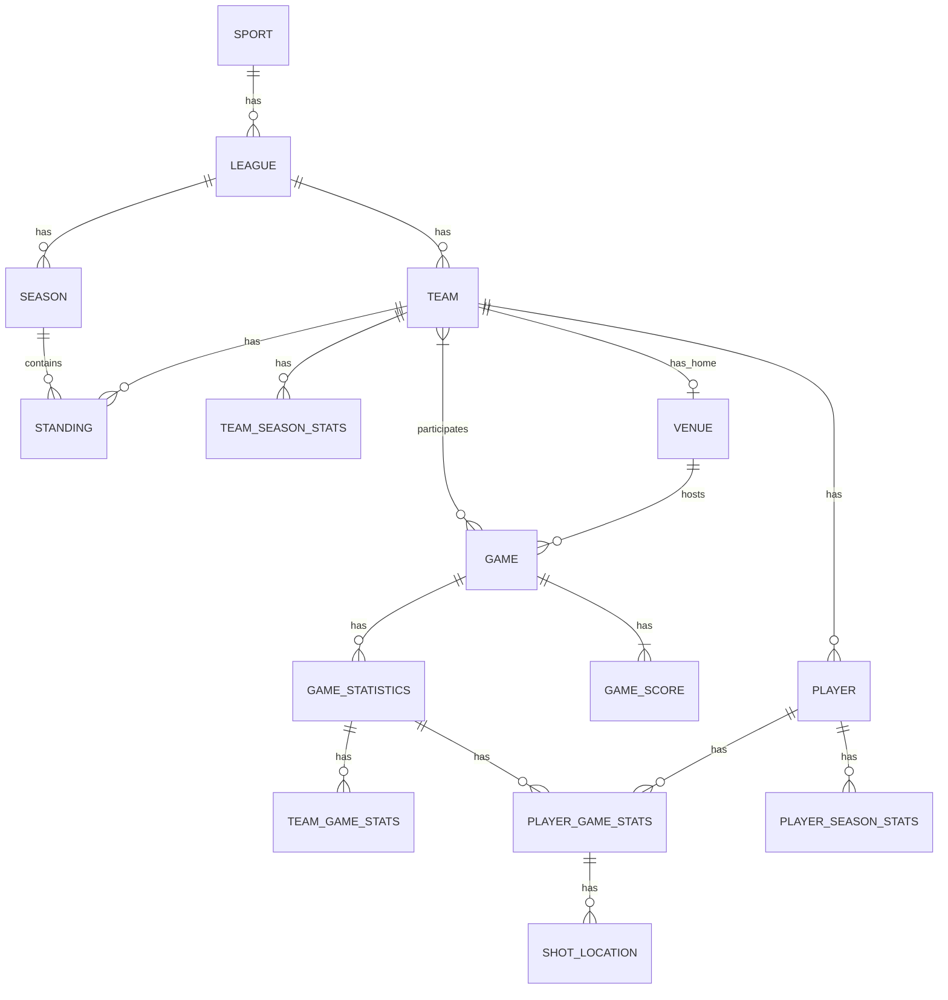

# 📊 Sports Stats & Live Scores Dashboard - Entity Relationships

## 🏗️ Entity Relationship Diagram (ERD)

## 📝 Entity Relationships

### Core Relationships
1. **Sport to League** (One-to-Many)
   - One sport can have multiple leagues/competitions
   - Example: Basketball → NBA, EuroLeague, NCAA

2. **League to Season** (One-to-Many)
   - One league can have multiple seasons
   - Example: NBA → 2022-2023 Season, 2023-2024 Season

3. **League to Team** (One-to-Many)
   - One league contains multiple teams
   - Example: NBA → Lakers, Celtics, Warriors

4. **Team to Player** (One-to-Many)
   - One team has multiple players
   - Example: Lakers → LeBron James, Anthony Davis

5. **Team to Game** (Many-to-Many)
   - Teams participate in multiple games
   - Each game involves exactly two teams (home and away)

### Statistical Relationships
6. **Game to Game Statistics** (One-to-One)
   - Each game has one collection of statistics

7. **Game Statistics to Team Game Stats** (One-to-Many)
   - Each game statistics entity contains stats for both teams

8. **Game Statistics to Player Game Stats** (One-to-Many)
   - Each game has statistics for multiple players

9. **Player to Player Game Stats** (One-to-Many)
   - One player has statistics for multiple games

10. **Player Game Stats to Shot Location** (One-to-Many)
    - Player stats for a game contain multiple shot locations for heatmaps

### Seasonal Relationships
11. **Season to Standing** (One-to-Many)
    - One season contains standings for multiple teams
    
12. **Team to Standing** (One-to-One per Season)
    - A team has exactly one standing per season

13. **Team to Team Season Stats** (One-to-One per Season)
    - A team has one set of aggregated statistics per season

14. **Player to Player Season Stats** (One-to-One per Season)
    - A player has one set of aggregated statistics per season

### Venue Relationships
15. **Venue to Game** (One-to-Many)
    - One venue hosts multiple games

16. **Team to Venue** (Many-to-One)
    - Multiple teams can share a venue, but typically each team has one home venue

## 🗄️ Relationship Cardinality

| Relationship | Cardinality | Foreign Key |
|--------------|-------------|-------------|
| Sport → League | 1:N | League.sportId |
| League → Season | 1:N | Season.leagueId |
| League → Team | 1:N | Team.leagueId |
| Team → Player | 1:N | Player.teamId |
| Team → Game | M:N | Game.homeTeamId & Game.awayTeamId |
| Game → Game Statistics | 1:1 | GameStatistics.gameId |
| Game Statistics → Team Game Stats | 1:N | TeamGameStats.gameId |
| Game Statistics → Player Game Stats | 1:N | PlayerGameStats.gameId |
| Player → Player Game Stats | 1:N | PlayerGameStats.playerId |
| Player Game Stats → Shot Location | 1:N | ShotLocation.playerId & ShotLocation.gameId |
| Season → Standing | 1:N | Standing.seasonId |
| Team → Standing | 1:1 per season | Standing.teamId & Standing.seasonId |
| Team → Team Season Stats | 1:1 per season | TeamSeasonStats.teamId & TeamSeasonStats.seasonId |
| Player → Player Season Stats | 1:1 per season | PlayerSeasonStats.playerId & PlayerSeasonStats.seasonId |
| Venue → Game | 1:N | Game.venue.id |
| Team → Venue | N:1 | Team.venue.id |

## 📊 Database Design Considerations

For this MVP focused on Basketball:

1. **Indexes**
   - Game date and status (for quickly finding live and upcoming games)
   - Team ID (for team-specific queries)
   - Player ID (for player-specific queries)
   - League and Season combinations (for season-specific data)

2. **Performance Optimizations**
   - Denormalize frequently accessed data (e.g., team and player names in game records)
   - Create materialized views or pre-aggregated statistics for dashboards
   - Index shot location data for efficient heatmap generation

3. **Data Validation**
   - Ensure game scores match the sum of quarter scores
   - Validate player statistics against team totals
   - Ensure consistent game status transitions (scheduled → live → finished)

4. **Real-time Considerations**
   - Design for efficient partial updates of game data
   - Optimize for frequent reads and periodic writes during live games
